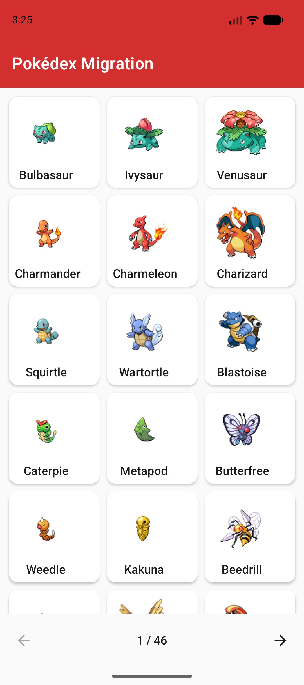
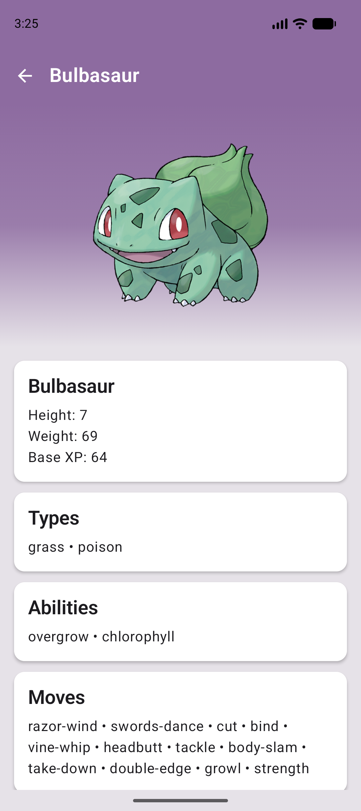

# Architecture Migration Example

Android sample that documents a real architecture evolution:

**MVP → MVVM → MVI → Jetpack Compose + modern stack**

Built as a Pokédex (list + detail) against the public [PokéAPI](https://pokeapi.co/), with clean layering across **data → domain → presentation**.

> Target audience: **senior Android interviews** — show migration judgment, not just a greenfield demo.

---

## Demo

| Home | Detail (type-colored header) |
|------|------------------------------|
|  |  |

- Paginated list with pull-to-refresh
- Detail screen tints header/background from Pokémon types (same rule as the original XML: last mapped type wins)
- Compose Material 3 + Navigation + Coil

---

## Why this repo exists

Most portfolio apps only show the final architecture. This one keeps the journey:

| Branch | Pattern | What it demonstrates |
|--------|---------|----------------------|
| [`mvp`](https://github.com/DwanZ/archMigrationExample/tree/mvp) | MVP + Clean | Contracts, presenters, explicit view callbacks |
| [`mvvm`](https://github.com/DwanZ/archMigrationExample/tree/mvvm) | MVVM + Clean | ViewModels replace presenters; LiveData/state ownership moves to VM |
| [`mvi`](https://github.com/DwanZ/archMigrationExample/tree/mvi) | MVI-style | Unidirectional flow: UI events → reducer-like VM → `StateFlow` |
| [`main`](https://github.com/DwanZ/archMigrationExample/tree/main) / [`feature/compose-ui-polish`](https://github.com/DwanZ/archMigrationExample/tree/feature/compose-ui-polish) | Compose + MVI | Material3 UI, Navigation Compose, Coil, UiEffects, type-colored detail |

Interview angle: *when* to migrate, *what* to keep, and how to ship incrementally without a big-bang rewrite.

---

## Current baseline

- Kotlin 1.9, Coroutines, `StateFlow`
- Clean architecture (repository, use cases, presentation)
- Koin 3 DI (+ Compose integration)
- Retrofit + OkHttp + Gson
- **Jetpack Compose (Material3)** list + detail
- Navigation Compose + one-shot **UiEffects** for navigation
- Coil for images
- AGP **8.7.3** / Gradle **8.9** / compileSdk **35**
- Unit tests (MockK + Turbine) + GitHub Actions CI

> **Android Studio tip:** set **Gradle JDK to 17** (`jbr-17`), not JDK 25. AGP 8.x requires JDK 17.

Legacy XML Activities remain in the repo for side-by-side comparison; the launcher is `MainActivity` (Compose).

## Modernization goals

- [x] Gradle + current AGP / Kotlin / compileSdk 35
- [x] Remove synthetics / `kotlin-android-extensions`
- [x] Jetpack Compose UI (list + detail)
- [x] Navigation Compose
- [x] Coil for images
- [x] MVI events + state + effects (navigation)
- [x] Unit tests for ViewModel (MockK + Turbine)
- [x] GitHub Actions: assemble + unit tests
- [x] Screenshots in this README
- [ ] Hilt migration (optional; Koin kept with intentional Compose wiring)

---

## App features

- Paginated Pokémon list
- Pokémon detail by name
- Loading / empty / error presentation states
- Navigation list → detail
- Type-based header/background colors on detail

---

## Architecture (high level)

```text
UI (Compose)
   ↓ events
ViewModel (state + effects / MVI)
   ↓
Use cases
   ↓
Repository
   ↓
Remote data source (PokéAPI)
```

Domain stays independent of UI framework so MVP → MVVM → MVI → Compose can evolve without rewriting networking each time.

---

## Getting started

```bash
git clone https://github.com/DwanZ/archMigrationExample.git
cd archMigrationExample
git checkout main   # or feature/compose-ui-polish for latest UI polish
```

Open in Android Studio, set Gradle JDK to **17**, sync Gradle, run the **`app`** configuration.

> Tip: compare the same screen across `mvp` / `mvvm` / `mvi` / Compose branches in an interview to walk through tradeoffs in 5–10 minutes.

---

## Tech decisions worth discussing

1. **Why MVI after MVVM?** Clearer event modeling, fewer ad-hoc LiveData channels, easier UI-state reasoning under concurrency.
2. **Why keep use cases?** Small app, but they document intent and stay testable when UI frameworks change.
3. **Why UiEffects for navigation?** Keeps UI state render-only; one-shot navigation does not pollute the state machine.
4. **Type colors on detail:** Port of the original XML `setHeaderColor` rule (last mapped type wins), extended to more types for contrast.
5. **Migration strategy:** branch-per-architecture instead of deleting history — useful for teams mid-migration (Compose adoption).

---

## Portfolio checklist

See [`docs/github-profile-readme.md`](docs/github-profile-readme.md) to publish your GitHub profile README and pin this repo.

---

## License

See [LICENSE](LICENSE).
